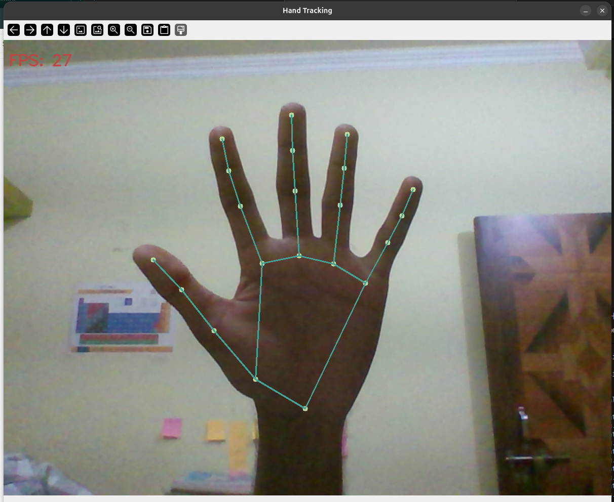
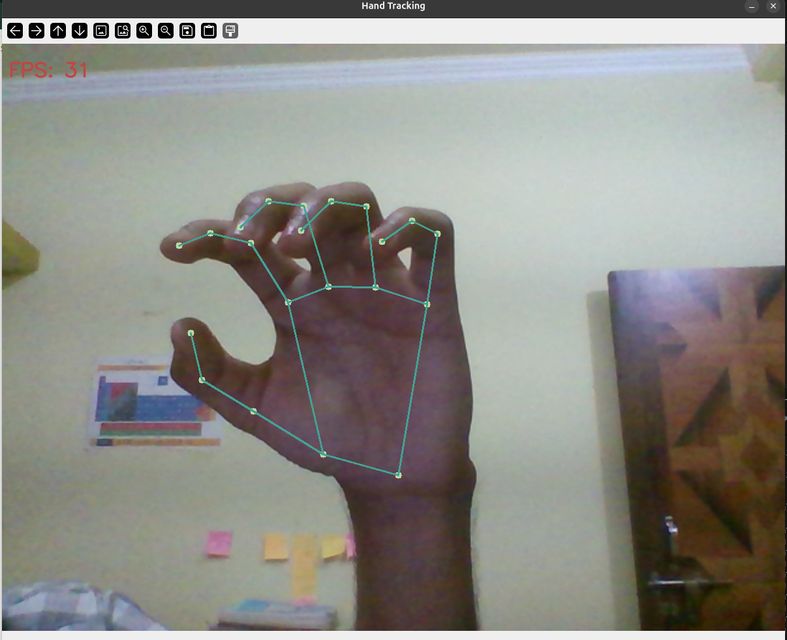

## Gestures Recognition
Recognizes gestures("Closed fist, Thumbs up, Thumbs down, Victory)
- can be trained to recognize any gesture

More gestures will be added

# How it looks:

1. 21 Hand Landmark points-

2. Hand Landmark connections-

3. Gesture Recognizer-

## Dependencies:
1. OpenCV (version 4.13.0) [pip install opencv-python](https://pypi.org/project/opencv-python/)

2. mediapipe (version 0.10.32) [pip install mediapipe](https://pypi.org/project/mediapipe/)
[Mediapipe Documentation](https://ai.google.dev/edge/mediapipe/solutions/vision/gesture_recognizer)

## NOTE:
- Must have the gesture_recognizer.task file